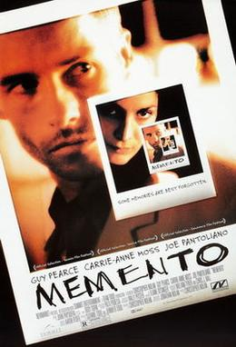

# Background

## LLMs can help us with:

::: large-font-slide
Text generation, translation, sentiment analysis, writing and debugging code, text to speech, speech to text, generating images and videos, etc.
:::

## Where are the models? Who makes them?

Many popular models live on the cloud

-   [OpenAI](https://openai.com/) (Known for GPT series including ChatGPT)
-   [Google AI](https://ai.google.dev/) (Gemini models)
-   [Anthropic](https://www.anthropic.com/) (Claude models)
-   [DeepSeek](https://www.deepseek.com/en) (DeepSeek R1)
-   [GitHub Copilot](https://github.com/copilot) (multiple models)

## Models != Providers

Companies train and release models for different use cases

::: incremental
-   General purpose, lightweight models, coding, etc.
-   Models may be open or proprietary
-   Cloud providers may host multiple models from different makers
-   Web-based chats include models + various tools (which are not necessarily evident)
:::

## Let's explore

::: large-font-slide
-   LLM [leaderboard](https://artificialanalysis.ai/leaderboards/models)
:::

## Cloud-Hosted models

:::::: columns
::: {.column width="43%"}
-   Relatively easy setup
-   Create account, set up billing if applicable, get an API key
-   Access to new and in-development models and massive computing power
:::

::: {.column width="4%"}
:::

::: {.column width="43%"}
-   Can be costly

-   Need internet access

-   We send our data to the API
:::
::::::

## Local models

Download smaller models on our own hardware

:::::: columns
::: {.column width="43%"}
-   Data not shared with a provider
-   No ongoing costs
-   Work offline
:::

::: {.column width="4%"}
:::

::: {.column width="43%"}
-   Steep learning curve
-   Large memory requirements
-   Slower performance
:::
::::::

 

#### Examples:

[`Ollama`](https://ollama.com/) (Simplifies running open-source LLMs locally)\
[Hugging Face `transformers`](https://huggingface.co/docs/transformers/index) (lots of open-source models)

## Which model do I use?

### Considerations

::::: columns
::: {.column width="50%"}
-   Pricing
-   Free tiers, token pricing, billing policies
-   Context Windows
-   **Compatibility with our chosen tools**
-   Speed
:::

::: {.column width="50%"}
-   Performance
-   Privacy
-   Hardware
:::
:::::

## Context switching

Shifting our attention between different tasks or programs can be tiring and make us less productive and efficient.

::: incremental
-   Ask the chatbot in the browser
-   Copy the response and paste it in R
-   Share the errors or output with the chat
-   Repeat (and potentially introduce errors)
:::

# Getting started

## Coding with LLMs

 

### Autocomplete

 

-   Models suggest 'ghost text' as we type\
-   Very distracting during teaching\
-   Suggestions may be unhelpful but mostly harmless

## Coding with LLMs

 

### Chats

 

-   Send prompts, get answers
-   Often let us provide context and upload files
-   Results can be copied or inserted directly to a script
-   In the browser or through APIs

## Coding with LLMs

 

### Agents/Agentic

::: incremental
-   Can run code and change files
-   Follow a general plan
-   Token-hungry and potentially slow
-   Makes us assume that results are correct
:::

# Conversations with LLMs

## Questions we might put in an LLM chat window?

 

::: retro-console-window
\> How do I add a subtitle to my ggplot figure?\
\> What are the arguments for pivot_wider()?\
\> I can't join my table_1 object with my dat3 data frame, help!
:::

 

. . .

Note the difference in the type of question. This will be important soon.

## Conversation with a chatbot

  🧍: name three mammals   🤖: dog, cat, mouse  

🧍: name three mammals   🤖: perro, gato, ratón

. . .

    **What happened?**

## System Prompts

Define specific instructions on role, tone, or constraints

 

### No system prompt?

-   Models default to base programming, leads to general and less predictable responses

## System Prompts

Repeatable, consistent results suited to what we need to do.

-   "you are an expert R programmer that only uses base R"

-   "you are an expert R programmer that only uses base R. Do not add any comments. Do not explain the output"

-   "you are an expert R programmer. Comment the code in French"

:::: rightref
::: refbox
ellmer prompt design [Vignette](https://ellmer.tidyverse.org/articles/prompt-design.html)
:::
::::

## LLMs are stateless

## LLMs are stateless

-   LLMs don't retain memory of prior interactions

-   Context happens by sending all previous messages with each new request

-   Because of limitations on tokens and context size, there are truncation and optimization strategies at work

## LLMs are stateless

::: {large-slide-text}
-   Start new chats often

-   Split up tasks across chats

-   Use detailed system prompts
:::

# Break

# License

All materials are licensed under a [Creative Commons Attribution 4.0 International License](https://creativecommons.org/licenses/by/4.0/) (CC-BY 4.0).