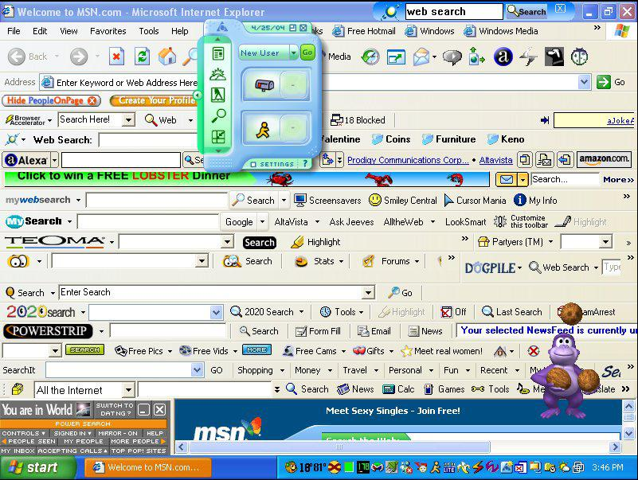

# Hands-on


## Contex-Aware Help

-   Ask the chatbot in the ~~browser~~ IDE
-   ~~Copy~~ Apply the response ~~and paste it~~ in R
-   ~~Share the errors or output with the chat~~
-   ~~Repeat (and potentially introduce errors)~~

## `ellmer` and friends

{width="26%"}

### Bridging R and LLMs

-   Robust and designed specifically for easy interaction with LLMs directly from R

-   Broad provider support and meant for entreprise/production use

-   Allows models to extend their capabilities by executing R code

## `ellmer` and friends

{width="26%"}

### Bridging R and LLMs

-   Outputs are immediately usable in R

-   Integrations to 'see' the R session

-   Strong dev team

## `gander`

::::: columns
::: {.column width="50%"}

:::

::: {.column width="50%"}
-   More than a simple chat window
-   Powered by `ellmer`
-   RStudio & Positron
:::
:::::

gander receives a snapshot of our environment with every request and recognizes what we are talking about, including object and variable names

## gander demo

We use ellmer to specify which model powers the addin (and optionally set a system prompt).

Today we can use openAI or Anthropic models.

-   use with `ctr+alt+G`

`ganderDemo.R`

Setup instructions for Positron [here](https://simonpcouch.github.io/gander/index.html)

## `ellmer` demo

```{r}
#| eval: false
#| echo: true

library(ellmer)
my_chat <- chat_openai() 
my_chat
```

<br/> Chat with the model then look at your chat object again

<br/> Create a new chat object with a different model and system prompt

## Interacting with the chat object

Without leaving R:

</br>

::::: columns
::: {.column width="50%"}
### In the R console

`live_console(my_chat)`
:::

::: {.column width="50%"}
### In our web browser

`live_browser(my_chat)`
:::
:::::

# Extension-based tools

## Positron (vsCode) extensions

Install from the OpenVSX marketplace from the *Extensions* pane

::: {large-slide-text}
-   Positron Assistant\
-   Continue\
-   Roo Code\
-   Windsurf\
:::

## Continue [continue.dev](https://www.continue.dev/)

> "Ship faster with Continuous AI"

Cool IDE features:

-   Chat
-   Autocomplete
-   Context Items
-   Agent mode
-   Planning mode

## Windsurf [windsurf.com](https://www.windsurf.com%5D)

-   formerly Codeium

> the most intuitive AI coding experience, built to keep you—and your team—in flow

Cool IDE features:

-   Chat

-   Autocomplete

-   Context Items

-   Base model included with free tier is Meta’s Llama 3.1 70B.

## Roo Code [roocode.com](https://roocode.com/)

> The AI dev team that gets things done

Cool IDE features:

-   Chat
-   Context Items
-   Multiple customizable 'personas' (agent, debugger, coder, code architect, etc)
-   Shows model details

## Positron Assistant

-   Comes with recent versions of Positron
-   Highly integrated
-   Meant for R and Python
-   Limited models supported at present
-   👀

## 

