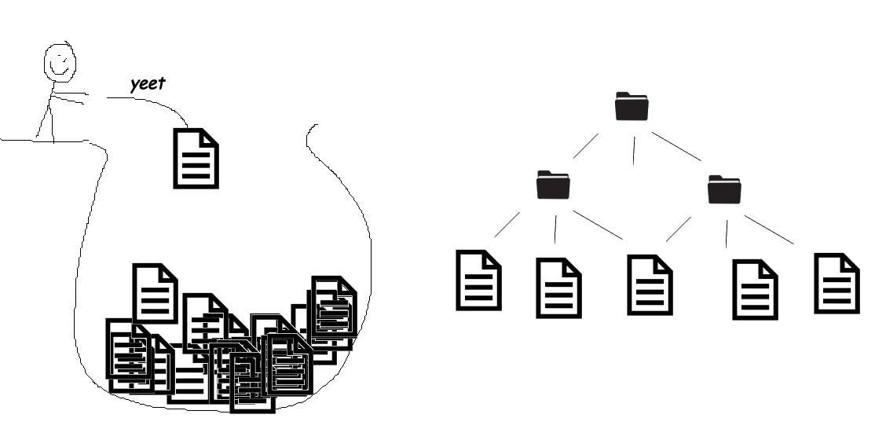

```{r fa packages setup}
#| echo: false
library(fontawesome)
```

## Hello!

:::::: columns
::: {.column width="30%"}
{width="80%"}\
[`r fontawesome::fa(name = "github")` \@LuisDVA](https://github.com/luisdva)\
[`r fontawesome::fa(name = "link")` liomys.mx](https://liomys.mx)\
[`r fontawesome::fa(name = "paper-plane")` luis\@liomys.mx](mailto:luis@liomys.mx)
:::

:::: {.column width="70%"}
::: smaller-font
-   Mammals, macroecology, conservation  
-   Certified Instructor - Posit(RStudio) & The Carpentries\
-   Online and in-person courses all year (Physalia Courses, Estación R, R for the Rest of Us)  
-   rOpenSci mentor 2023-2026  
-   Package developer  
-   R conference speaker + organizer  
-   R-Ladies collaborator 
:::
::::
::::::

## Online Guide

-Tools, packages, and extensions for working with LLMs + R - English and Spanish, updated 2x/month

](imgs/llmcov.png)

## 🤝 More introductions

-   Are you an AI {skeptic \| enthusiast \| pragmatist} ? <br>
-   Have you been pleasantly surprised/impressed by an AI tool? <br>
-   Have you been disappointed or burned by an AI tool?

# Setup

## Projects



## Project-oriented workflow

*Project*: A folder on your computer that holds all the files relevant to a particular piece of work. We usually separate:

📁 Data\
📁 Scripts\
📁 Outputs\

::::::: rightref
:::::: refbox
::::: columns
::: {.column width="50%"}
Jenny Bryan (2017)\
[Project-oriented workflow](https://www.tidyverse.org/blog/2017/12/workflow-vs-script/)
:::

::: {.column width="50%"}
Maëlle Salmon (2021)\
[Draw me a project](https://masalmon.eu/2021/06/30/r-projects/)
:::
:::::
::::::
:::::::

## Projects

-   Efficient and organized workflows
-   Relative file paths and working directories
-   **Safer and cheaper approach when using AI assistants**

## IDEs

::::: columns
::: {.column width="50%"}
### RStudio

-   Familiar and trusted
-   AI tools available (fewer GUI options)
-   Not going anywhere
:::

::: {.column width="50%"}
### Positron

-   Extensible
-   Built-in LLM tools
-   Constant development
-   Alternatives available
:::
:::::

## Positron?

Positron for RStudio Users: A Gentle Introduction\
**Isabella Velazquez** - Oct. 2025

-   [Video](https://www.youtube.com/watch?v=2fOQzgkxi6g)
-   [Slides](https://ivelasq.rbind.io/talk/positron-for-rstudio-users-presentation/)

# IDE tour and setup

## 

</br> </br>

We'll use cloud-based models for this course. More on this later.


## API Keys

Working with APIs means we need to identify ourselves to the model provider and authenticate our encrypted connection to their servers

</br>

#### Overall workflow

-   Create and account with a model provider
-   💳 ?
-   Generate an API key
-   Keep it safe but reachable by your LLM tools

## 

### In R

Most packages work with keys stored in Environment Variables.

### In GUI-based assistants

We enter our keys interactively

</br>

⚠️ Never share API keys in public repositories, network drives, shared documents or screen recordings.

::::::: rightref
:::::: refbox
::::: columns
::: {.column width="50%"}
H. Wickham <br> [Managing secrets](https://cran.r-project.org/web/packages/httr/vignettes/secrets.html)
:::

::: {.column width="50%"}
Ted Laderas <br> [A gRadual introduction to web APIs and JSON](https://www.youtube.com/watch?v=HA7KfdEsdpo)
:::
:::::
::::::
:::::::

## API key setup

We'll provide keys for two popular providers. These will only be active during the course hours.

### R

Temporary: `Sys.setenv(OPENAI_API_KEY = "api_key")` (quoted)  or "`ANTHROPIC_API_KEY`"

Permanent: `usethis::edit_r_environ()`

# Break